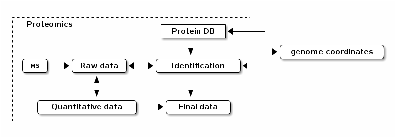

```{r env, echo=FALSE, warning=FALSE}
suppressPackageStartupMessages(library("Pbase"))
suppressPackageStartupMessages(library("MSnbase"))
suppressPackageStartupMessages(library("rtracklayer"))
library("knitr")
opts_chunk$set(fig.width=12, fig.height=7)
data(p)
```

# Use case 1: mapping peptides 

**Mapping** of *peptides along protein sequences (although not
explicitly considered a mapping exercise)* and *short reads along
genome coordinates*.

# Mapping protein and gene identifers

The protein database and the genome are _independent_, i.e. the
proteins do not make explicitly reference to the genome they originate
from.


# Mapping protein and gene identifers



If we want to map UniProt accession numbers to genomic identifiers
(Ensembl transcipt identifiers)

# Mapping peptides to genomic coordinates

The **goal** is to map peptides from protein coordinates (1 to *L_p*)
to genomic coordinates.

```{r mapplot, echo=FALSE, fig.heigth=6}
Pbase:::mapplot()
```

# Data

Illustration with the
[`Pbase`](http://bioconductor.org/packages/devel/bioc/html/Pbase.html)
Bioconductor package.

We have an example data composed of `r length(p)`
proteins, with UniProt accession numbers and Ensembl transcipt
identifiers and each protein has a set experimentally observed
peptides (see table below). This object was generated from the
protein database (fasta file) and the MS identification results
(`mzIdentML` file) against this very same protein database.

# 

```{r xids, echo=FALSE}
kable(cbind(Acc = seqnames(p),
            ENST = acols(p)$ENST,
            npep = elementNROWS(pranges(p))),
      row.names = 0)
```

# 

For example, `r seqnames(p)[5]`:

```{r pplot1, echo=FALSE}
plot(p[5])
```

# Genomic coordinates of the transcripts/exons

```{r etrid2grl, echo=TRUE, cache=TRUE, echo=FALSE}
grl <- etrid2grl(acols(p)$ENST)
## grl <- renameSeqlevels(grl, paste0("chr", seqlevels(grl)))
pcgrl <- proteinCoding(grl)
```

```{r gviz1, echo=FALSE, cache=TRUE}
plotAsGeneRegionTrack(grl[[5]], pcgrl[[5]])
```

# Mapping peptides to the genome

```{r pmap, echo=FALSE}
res <- pmapToGenome(p, pcgrl)
```

```{r gviz2, echo=FALSE}
plotAsAnnotationTrack(res[[5]], grl[[5]])
```

# Detailed annotation tracks

Maintaining access to the raw MS data (used as input with the fasta
file to generate the identification results).

```{r gviz3, echo=FALSE}
data(pms)
.res <- res[[5]]

library("ggplot2")
details <- function(identifier, ...) {
    p <- plot(pms[[as.numeric(identifier)]], full=TRUE, plot=FALSE) + ggtitle("") 
    p <- p + theme_bw() + theme(axis.text.y = element_blank(),
                                axis.text.x = element_blank()) + 
                                labs(x = NULL, y = NULL)
    print(p, newpage=FALSE)
}

deTrack <- AnnotationTrack(start = start(.res),
                           end = end(.res),
                           genome = "hg38", chromosom = "chrX",
                           id = pcols(p)[[5]]$acquisitionNum,
                           name = "MS2 spectra",
                           stacking = "squish", fun = details)

grTrack <- GeneRegionTrack(grl[[5]],
                           name = acols(p)$ENST[5])
ideoTrack <- IdeogramTrack(genome = "hg38",
                           chromosome = "chrX")
axisTrack <- GenomeAxisTrack()

plotTracks(list(ideoTrack, axisTrack, deTrack, grTrack),
           add53 = TRUE, add35 = TRUE)
```


# Multiple transcipts per protein

If we hadn't the curated UniProt accession/Ensembl transcript
identifer maps, we would, for example, query an online repositary such
as the Ensembl Biomart instance. For example

```{r P02545, echo=FALSE, cache=TRUE, message=FALSE}
library("UniProt.ws")
upws <- UniProt.ws()
bm2 <- suppressMessages(select(upws, "P02545", "ENSEMBL_TRANSCRIPT", "UNIPROTKB"))
eid <- bm2[, 2]
library("biomaRt")
ens <- useMart("ensembl", "hsapiens_gene_ensembl")
```

```{r bm2tab, echo=FALSE}
kable(bm2, row.names = 0)
```

# Genomic coordinates

Let's fetch the coordinates of all possible transcipts, making sure
that the names of the Ensembl identifiers are used to name the grl
ranges (using `use.names = TRUE`). We obtain 30 sets of ranges for 9
proteins.

```{r pcgrl, echo=FALSE}
## eid
grl <- etrid2grl(eid, ens, use.names = TRUE)
## grl <- renameSeqlevels(grl, paste0("chr", seqlevels(grl)))
pcgrl <- proteinCoding(grl)
```

```{r givtr, echo=FALSE}
grTr <- lapply(pcgrl, function(i)
    GeneRegionTrack(i, name = mcols(i)$transcript[1]))

plotTracks(grTr)
```

# Discriminating transcripts

```{r protfromgenome, echo=FALSE, message=FALSE}
library("BSgenome.Hsapiens.NCBI.GRCh38")
if (!"chr1" %in% seqnames(BSgenome.Hsapiens.NCBI.GRCh38))
    seqnames(BSgenome.Hsapiens.NCBI.GRCh38)[1:23] <-
        paste0("chr", seqnames(BSgenome.Hsapiens.NCBI.GRCh38)[1:23])
```

We extract the transcript sequences, translate them into protein
sequences and align each to our original protein sequence.

```{r aln, warnings=FALSE, echo=FALSE}
library("BSgenome.Hsapiens.NCBI.GRCh38")
lseq <- lapply(getSeq(BSgenome.Hsapiens.NCBI.GRCh38, pcgrl),
               function(s) translate(unlist(s)))

k <- 6
laln <- sapply(lseq, pairwiseAlignment, aa(p[k]))
```

\tiny

```{r align, echo=FALSE}
sapply(laln, nmatch)/width(aa(p[k]))
ki <- which.max(sapply(laln, nmatch))
laln[[ki]]
```

# 

```{r checkk, echo=FALSE}
stopifnot(eid[ki] == acols(p)$ENST[k])
```

```{r map, echo=FALSE}
res <- pmapToGenome(p[k], pcgrl[ki])
```

```{r pepcoords2, echo=FALSE}
res <- res[[1]]
pepTr <- AnnotationTrack(start = start(res),
                         end = end(res),
                         chr = chrom(res),
                         strand = strand(res),
                         id = mcols(res)$pepseq,
                         group = mcols(res)$group,
                         fill = ifelse(mcols(res)$exonJunctions, "red", "steelblue"),
                         col = NULL,
                         name = mcols(res)$transcript[1])

plotTracks(list(grTr[[ki]], pepTr))
```

# Mapping MS peptides and RNA-Seq short reads

The last step of the mapping process is the combine the newly mapped
peptides and reads from RNA-Seq experiments. The figures below
illustrate this with data from Sheynkman et
al. ([PMID: 23629695](http://www.ncbi.nlm.nih.gov/pubmed/23629695),
[25149441](http://www.ncbi.nlm.nih.gov/pubmed/25149441)) from the
Jurkat cell line (TIB-152). The mass spectrometry
([PASS00215](https://db.systemsbiology.net/sbeams/cgi/PeptideAtlas/PASS_View?identifier=PASS00215))
and
[RNA-Seq](http://www.ncbi.nlm.nih.gov/geo/query/acc.cgi?acc=GSE45428)
(SRR791580) where processed with standard pipelines.


#

```{r peptrack, echo=FALSE}
suppressPackageStartupMessages(library("Gviz"))
load("./data/peptrack.rda")
## plotTracks(peptrack[-5])
```

```{r peptrack2, echo=FALSE}
plotTracks(peptrack)
```

#

```{r alntrack, echo=FALSE}
options(ucscChromosomeNames=FALSE)
load("./data/alntrack.rda")
alntrack[[2]]@reference <- "./data/mybam.bam"
plotTracks(alntrack, from = 30116807, to = 30186474)
```

#

For all details/code see the `Pbase` package mapping vignette
http://bioconductor.org/packages/Pbase


# Use case 1: mapping peptides 

**Mapping** of *peptides along protein sequences (although not
explicitly considered a mapping exercise)* and *short reads along
genome coordinates*.

But...

- coverage
- protein inference
- identifier mapping
- missing values

# Coverage

- Coverage in proteomics in `%`
- [Coverage](http://www.ncbi.nlm.nih.gov/pubmed/24434847) in RNA-Seq in fold `X`

The following values are higher bounds, *without* peptide filtering for
about 80000 *gene groups* 

```{r cvg, echo=FALSE, fig.height=5}
cvg <- data.table::fread("./data/Ensembl_76.csv", skip = 17,
                         stringsAsFactors = FALSE)
sel <- cvg$length > 100 & cvg$length < 10000
cvg <- cvg[sel, ]
hist(cvg$coverage, breaks = 100, xlab = "coverage", main = "")
```

# And

- the majority of peptides map to a minority of proteins different

- peptides within one protein can be differently detectable in MS
  acquistions

# Protein inference

<!--  -->


From [Qeli and Ahrens (2010)](http://www.ncbi.nlm.nih.gov/pubmed/20622826).
See also [Nesvizhskii and Aebersold (2005)](http://www.ncbi.nlm.nih.gov/pubmed/16009968).

# Protein groups

Often, in proteomics experiments, the features represent single
proteins and **groups** of indistinguishable or non-differentiable
proteins identified by shared (non-unique) peptides.

**Caveat**: Mapping between protein groups and unique transcripts?

# Mapping identifiers

```{r ids, echo=FALSE, cache=TRUE}
## The UniProt human proteome (release 2015_02)
library("Pbase")
up <- Proteins("data/HUMAN_2015_02.fasta.gz")

if (file.exists("data/upens.rda")) {
	load(file = "data/upens.rda")
} else {
	library("UniProt.ws")
	upws <- UniProt.ws()
	## Using the accession number to query for transcript identifiers
	upens <- select(upws, seqnames(up), "ENSEMBL_TRANSCRIPT", "UNIPROTKB")
}	
```

The UniProt human proteome (release 2015_02) has `r length(up)`
entries. Using
[`UniProt.ws`](http://www.bioconductor.org/packages/release/bioc/html/UniProt.ws.html):

- `r sum(tapply(upens[, 2], upens[, 1], function(x) length(na.omit(x))) == 0)`
  have no transcript identifier

- `r sum(tapply(upens[, 2], upens[, 1], function(x) length(na.omit(x))) == 1)`
  have a unique transcript identifier

- `r sum(tapply(upens[, 2], upens[, 1], function(x) length(na.omit(x))) > 1)`
  have more than one transcript identifier


```{r ids1, echo=FALSE, fig.heigth=4}
barplot(table(tapply(upens[, 2], upens[, 1], function(x) length(na.omit(x)))))
```

# Using `biomaRt`:

```{r upids, eval=TRUE, echo=FALSE}
if (file.exists("./data/upbm.rda")) {
	load("./data/upbm.rda")
} else {
## same via biomart - very different numbers
	library("biomaRt")
	ens <- useMart("ensembl", "hsapiens_gene_ensembl")
	upbm <- select(ens, keys = seqnames(up),
	               keytype = "uniprot_swissprot",
                   columns = c("uniprot_swissprot",
                               "ensembl_transcript_id"))
}

## length(unique(upbm$uniprot_swissprot))
tab <- rbind(table(seqnames(up) %in% unique(upbm$uniprot_swissprot)))
## kable(tab)

tab <- rbind(table(table(upbm$uniprot_swissprot)))
```

Mapping `r length(unique(upbm$uniprot_swissprot))` identifiers, of which

```{r bmplot, echo=FALSE, fig.height=5}
barplot(tab)
```

**Caveat**: Mapping between single protein and unique transcripts?

# Missing values

<!-- An example data: -->

```{r, echo=FALSE}
library("MSnbase")
data(naset)
## naset
## table(is.na(naset))
## table(fData(naset)$nNA)
```

Options are:

- Filtering: Remove missing values, or at least features or samples
  with excessive number of missing values:

```{r, eval=FALSE, echo=FALSE}
flt <- filterNA(naset)
processingData(flt)
any(is.na(filterNA(naset)))
```

- Data imputation: infering plausible values for missing data.


# Data imputation

There are two types of mechanisms resulting in missing values in
LC/MSMS experiments.

- Missing values resulting from absence of detection of a feature,
  despite ions being present at detectable concentrations.  For
  example in the case of ion suppression or as a result from the
  stochastic, data-dependent nature of the MS acquisition
  method. These missing value are expected to be randomly distributed
  in the data and are defined as **missing at random** (MAR) or
  **missing completely at random** (MCAR).

- Biologically relevant missing values, resulting from the *absence*
  of the low abundance of ions (below the limit of detection of the
  instrument). These missing values are not expected to be randomly
  distributed in the data and are defined as **missing not at random**
  (MNAR).

# 


MNAR features should ideally be imputed with a **left-censor**
(minimum value (right), but not zero, ...)  method. Conversely, it is recommended to
use **hot deck** methods (nearest neighbour (left), maximum likelihood, ...)
when data are missing at random.


# References

\tiny

Laurent Gatto and Sebastian Gibb
(2016). [`Pbase`](http://bioconductor.org/packages/devel/bioc/html/Pbase.html):
Manipulating and exploring protein and proteomics data. R package
version 0.11.3. https://github.com/ComputationalProteomicsUnit/Pbase

Lazar C, Gatto L, Ferro M, Bruley C, and Burger T. Accounting for the
Multiple Natures of Missing Values in Label-Free Quantitative
Proteomics Data Sets to Compare Imputation Strategies. Publication
Date: February 23, 2016 DOI: 10.1021/acs.jproteome.5b00981

Pang et al. Tools to covisualize and coanalyze proteomic data with
genomes and transcriptomes: validation of genes and alternative mRNA
splicing. J Proteome Res. 2014 Jan 3;13(1):84-98. doi:
10.1021/pr400820p. Epub 2013 Nov 12. PubMed
[PMID: 24152167](http://www.ncbi.nlm.nih.gov/pubmed/24152167).

Sheynkman GM, Johnson JE, Jagtap PD, Shortreed MR, Onsongo G, Frey BL,
Griffin TJ, Smith LM. Using Galaxy-P to leverage RNA-Seq for the
discovery of novel protein variations. BMC Genomics. 2014 Aug
22;15:703. doi: 10.1186/1471-2164-15-703. PubMed
[PMID: 25149441](http://www.ncbi.nlm.nih.gov/pubmed/25149441).

Qeli E, Ahrens CH. PeptideClassifier for protein inference and
targeted quantitative proteomics. Nat Biotechnol. 2010
Jul;28(7):647-50. doi: 10.1038/nbt0710-647. PubMed
[PMID: 20622826](http://www.ncbi.nlm.nih.gov/pubmed/20622826).

Boekel J, Chilton JM, Cooke IR, Horvatovich PL, Jagtap PD, Käll L,
Lehtiö J, Lukasse P, Moerland PD, Griffin TJ. Multi-omic data analysis
using Galaxy. Nat Biotechnol. 2015 Feb 6;33(2):137-9. doi:
10.1038/nbt.3134. PubMed
[PMID: 25658277](http://www.ncbi.nlm.nih.gov/pubmed/25658277).

Evans VC, Barker G, Heesom KJ, Fan J, Bessant C, Matthews DA. De novo
derivation of proteomes from transcriptomes for transcript and protein
identification. Nat Methods. 2012 Dec;9(12):1207-11. doi:
10.1038/nmeth.2227.  Epub 2012 Nov 11. PubMed
PMID:[23142869](http://www.ncbi.nlm.nih.gov/pubmed/23142869); PubMed
Central PMCID:PMC3581816.


