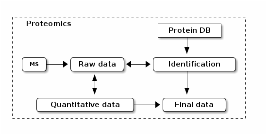

# Proteomics data: caveats

**Mapping** of *peptides along protein sequences (although not
  explicitly considered a mapping task)* and *short reads along genome
  coordinates*.

But...

## Protein inference


From
[Nesvizhskii and Aebersold (2005)](http://www.ncbi.nlm.nih.gov/pubmed/16009968). Often,
in proteomics experiments, the features represent single proteins and
groups of indistinguishable proteins identified by shared (non-unique)
peptides.

## Mapping protein and gene identifers

The protein database and the genome are _independent_, i.e. the
proteins do not make explicitly reference to the genome they originate
from.




```{r ids, cache=TRUE}
## The UniProt human proteome (release 2015_02)
suppressPackageStartupMessages(library("Pbase"))
up <- Proteins("data/HUMAN_2015_02.fasta.gz")
length(up)

## Using the accession number to Ensembl Biomart query
## for transcript identifiers
library("biomaRt")
ens <- useMart("ensembl", "hsapiens_gene_ensembl")
ens
upbm <- select(ens, keys = seqnames(up),
               keytype = "uniprot_swissprot_accession",
               columns = c(
                   "uniprot_swissprot_accession",
                   "ensembl_transcript_id"))
```

```{r ids1}
## How many UniProt accession with Ensembl transcripts were found?
table(seqnames(up) %in% unique(upbm$uniprot_swissprot_accession))
```

```{r ids2}
## How many transcripts per accession do we find?
table(table(upbm$uniprot_swissprot_accession))
```

## Coverage

**coverage** in proteomics in `%` and RNA-Seq `X`

```{r cvg}
cvg <- data.table::fread("./data/Ensembl_76.csv", skip = 17,
                         stringsAsFactors = FALSE)
summary(cvg$coverage)
```

This has an impact on **protein inference* and **missing values**.

## Missing values


