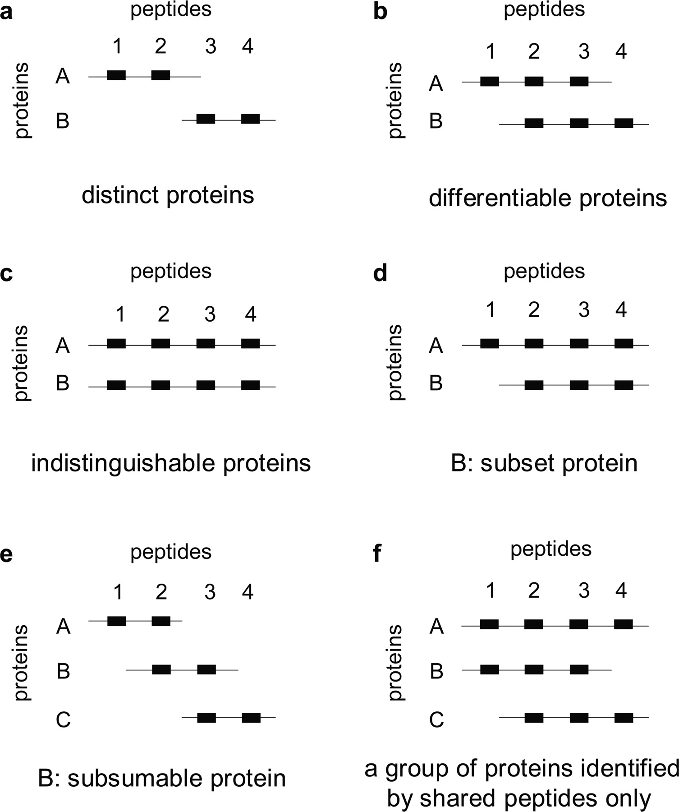

# Integrating proteomics data: caveats


**Mapping** of *peptides along protein sequences (although not
  explicitly considered a mapping task)* and *short reads along genome
  coordinates*.

But...

## Protein inference



From [Nesvizhskii and Aebersold (2005)](http://www.ncbi.nlm.nih.gov/pubmed/16009968)

## Mapping protein and gene identifers

The protein database and the genome are _independent_, i.e. the
proteins do not make explicitly reference to the genome they originate
from.


```r
## The UniProt human proteome (release 2015_02)
suppressPackageStartupMessages(library("Pbase"))
up <- Proteins("data/HUMAN_2015_02.fasta.gz")
length(up)
```

```
## [1] 89796
```

```r
## Using the accession number to Ensembl Biomart query
## for transcript identifiers
library("biomaRt")
ens <- useMart("ensembl", "hsapiens_gene_ensembl")
ens
```

```
## Object of class 'Mart':
##  Using the ensembl BioMart database
##  Using the hsapiens_gene_ensembl dataset
```

```r
upbm <- select(ens, keys = seqnames(up),
               keytype = "uniprot_swissprot_accession",
               columns = c(
                   "uniprot_swissprot_accession",
                   "ensembl_transcript_id"))
```


```r
## How many UniProt accession with Ensembl transcripts were found?
table(seqnames(up) %in% unique(upbm$uniprot_swissprot_accession))
```

```
## Error in match(x, table, nomatch = 0L): could not find function "seqnames"
```


```r
## How many transcripts per accession do we find?
table(table(upbm$uniprot_swissprot_accession))
```

```
## 
##    1    2    3    4    5    6    7    8    9   10   11   12   13   14   15 
## 8237 5056 2602 1404  713  383  219  112   78   56   35   17   16   15   12 
##   16   17   18   19   20   21   22   23   24   27   29   30   31   32   33 
##    8    7    4    6    5    5    2    2    3    1    1    1    2    3    1 
##   35   42   44   50   59   90 
##    3    2    1    1    1    1
```

## Coverage

**coverage** in proteomics in `%` and RNA-Seq `X`


```r
cvg <- data.table::fread("./data/Ensembl_76.csv", skip = 17,
                         stringsAsFactors = FALSE)
summary(cvg$coverage)
```

```
##    Min. 1st Qu.  Median    Mean 3rd Qu.    Max. 
##   0.000   6.813  38.890  39.870  67.620 100.000
```

This has an impact on **protein inference* and **missing values**.

## Missing values


