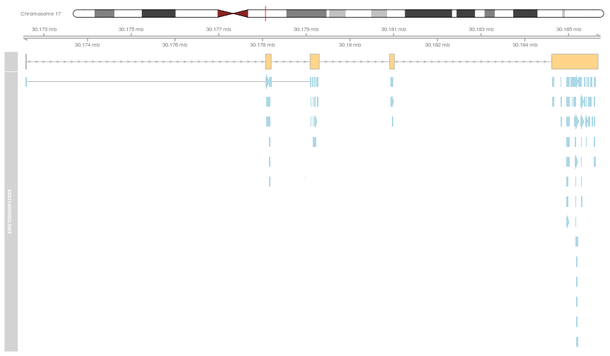
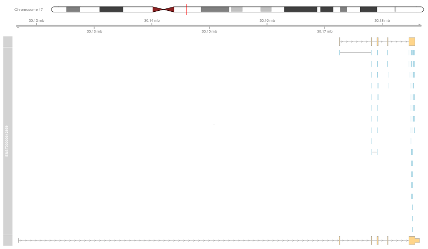
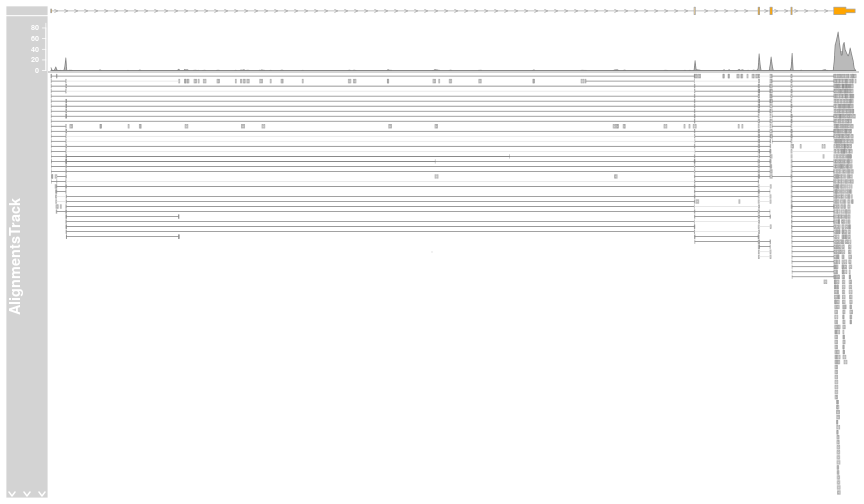

# Mapping MS peptides and RNA-Seq short reads


```r
library("knitr")
opts_chunk$set(fig.width=12, fig.height=7)
```

The last step of the mapping process is the combine the newly mapped
peptides and reads from RNA-Seq experiments. The figures below
illustrate this with data from Sheynkman et
al. ([2013](http://www.ncbi.nlm.nih.gov/pubmed/23629695),
[2014](http://www.ncbi.nlm.nih.gov/pubmed/25149441)) from the Jurkat
cell line (TIB-152). The
[mass spectrometry](https://db.systemsbiology.net/sbeams/cgi/PeptideAtlas/PASS_View?identifier=PASS00215)
and
[RNA-Seq](http://www.ncbi.nlm.nih.gov/geo/query/acc.cgi?acc=GSE45428)
(SRR791580) where processed with standard pipelines. 


  


```r
options(ucscChromosomeNames=FALSE)
load("./data/alntrack.rda")
plotTracks(alntrack, from = 30116807, to = 30186474)
```

```
## Error in colnames(mcols(data)): error in evaluating the argument 'x' in selecting a method for function 'colnames': Error in mcols(data) : 
##   error in evaluating the argument 'x' in selecting a method for function 'mcols': Error in x@stream(x@reference, subRegion) : 
##   Unable to find index for BAM file './mybam.bam'. You can build an index using the following command:
## 	library(Rsamtools)
## 	indexBam("./mybam.bam")
```

 
