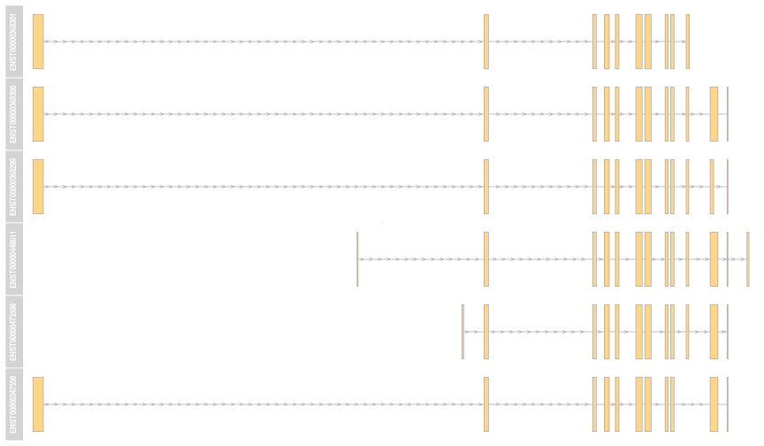
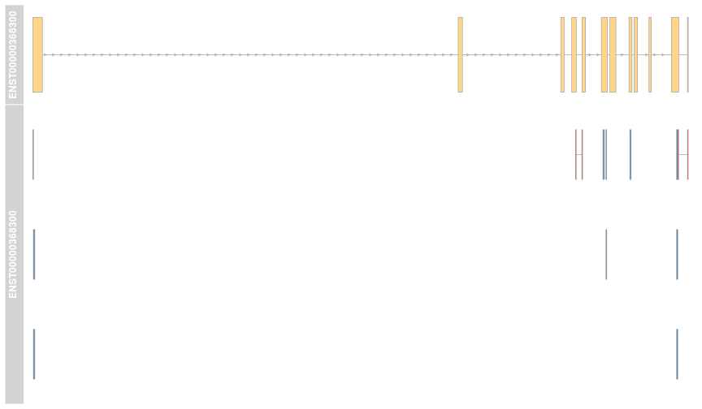

# Multiple transcipts per protein


Illustration with the
[`Pbase`](http://bioconductor.org/packages/devel/bioc/html/Pbase.html)
Bioconductor package (devel version).

## Data

We have an example data, named `p`, composed of 9
proteins, with UniProt accession numbers and Ensembl transcipt
identifers and each protein has a set experimentally observed
peptides:


|Acc      |ENST            |npep |
|:--------|:---------------|:----|
|A4UGR9   |ENST00000409195 |36   |
|A6H8Y1   |ENST00000358731 |23   |
|O43707   |ENST00000252699 |6    |
|O75369   |ENST00000295956 |13   |
|P00558   |ENST00000373316 |5    |
|P02545   |ENST00000368300 |12   |
|P04075   |ENST00000338110 |21   |
|P04075-2 |ENST00000395248 |20   |
|P60709   |ENST00000331789 |1    |

If we hadn't the curated UniProt accession/Ensembl transcript
identifer maps, we would, for example, query an online repositary such
as the Ensembl Biomart instance.


```r
library("biomaRt")
ens <- useMart("ensembl", "hsapiens_gene_ensembl")
ens
```

```
## Object of class 'Mart':
##  Using the ensembl BioMart database
##  Using the hsapiens_gene_ensembl dataset
```


```r
bm <- select(ens, keys = seqnames(p),
             keytype = "uniprot_swissprot_accession",
             columns = c(
                 "uniprot_swissprot_accession",
                 "ensembl_transcript_id"))

bm
```

```
##    uniprot_swissprot_accession ensembl_transcript_id
## 1                       A4UGR9       ENST00000409043
## 2                       A4UGR9       ENST00000409728
## 3                       A4UGR9       ENST00000409195
## 4                       A4UGR9       ENST00000409273
## 5                       A4UGR9       ENST00000409605
## 6                       A6H8Y1       ENST00000617085
## 7                       A6H8Y1       ENST00000358731
## 8                       O43707       ENST00000252699
## 9                       O43707       ENST00000390009
## 10                      O75369       ENST00000490882
## 11                      O75369       ENST00000295956
## 12                      O75369       ENST00000358537
## 13                      O75369       ENST00000429972
## 14                      P00558       ENST00000373316
## 15                      P02545       ENST00000368301
## 16                      P02545       ENST00000368300
## 17                      P02545       ENST00000368299
## 18                      P02545       ENST00000448611
## 19                      P02545       ENST00000473598
## 20                      P02545       ENST00000508500
## 21                      P02545       ENST00000347559
## 22                      P04075       ENST00000338110
## 23                      P04075       ENST00000395248
## 24                      P04075       ENST00000566897
## 25                      P04075       ENST00000569545
## 26                      P04075       ENST00000563060
## 27                      P04075       ENST00000412304
## 28                      P04075       ENST00000564546
## 29                      P04075       ENST00000564595
## 30                      P60709       ENST00000331789
```


If we focus on P02545 for example, we see that we
retrieve 7 possible transcript identifers, including our
annotated ENST00000368300.


|uniprot_swissprot_accession |ensembl_transcript_id |
|:---------------------------|:---------------------|
|P02545                      |ENST00000368301       |
|P02545                      |ENST00000368300       |
|P02545                      |ENST00000368299       |
|P02545                      |ENST00000448611       |
|P02545                      |ENST00000473598       |
|P02545                      |ENST00000508500       |
|P02545                      |ENST00000347559       |

## Genomic coordinates

Let's fetch the coordinates of all possible transcipts, making sure
that the names of the Ensembl identifiers are used to name the grl
ranges (using `use.names = TRUE`). We obtain 30 sets of ranges for 9
proteins.


```r
eid
```

```
##            P02545            P02545            P02545            P02545 
## "ENST00000368301" "ENST00000368300" "ENST00000368299" "ENST00000448611" 
##            P02545            P02545            P02545 
## "ENST00000473598" "ENST00000508500" "ENST00000347559"
```

```r
grl <- etrid2grl(eid, ens, use.names = TRUE)
pcgrl <- proteinCoding(grl)
```


```r
grTr <- lapply(pcgrl, function(i)
    GeneRegionTrack(i, name = mcols(i)$transcript[1]))

plotTracks(grTr)
```

 

## Discriminating transcripts


We extract the transcript sequences, translate them into protein
sequences and align each to our original protein sequence.


```r
library("BSgenome.Hsapiens.NCBI.GRCh38")
lseq <- lapply(getSeq(BSgenome.Hsapiens.NCBI.GRCh38, pcgrl),
               function(s) translate(unlist(s)))

laln <- sapply(lseq, pairwiseAlignment, aa(p[k]))
sapply(laln, nmatch)/width(aa(p[k]))
```

```
##    P02545    P02545    P02545    P02545    P02545    P02545    P02545 
## 0.8614458 1.0000000 0.9246988 0.8298193 0.8358434 0.3915663 0.9548193
```


```
## ########################################
## # Program: Biostrings (version 2.35.11), a Bioconductor package
## # Rundate: Thu Feb 26 01:29:05 2015
## ########################################
## #=======================================
## #
## # Aligned_sequences: 2
## # 1: P1
## # 2: P02545
## # Matrix: NA
## # Gap_penalty: 14.0
## # Extend_penalty: 4.0
## #
## # Length: 665
## # Identity:     664/665 (99.8%)
## # Similarity:    NA/665 (NA%)
## # Gaps:           1/665 (0.2%)
## # Score: 2843.652
## #
## #
## #=======================================
## 
## P1                 1 METPSQRRATRSGAQASSTPLSPTRITRLQEKEDLQELNDRLAVYIDRVR     50
##                      ||||||||||||||||||||||||||||||||||||||||||||||||||
## P02545             1 METPSQRRATRSGAQASSTPLSPTRITRLQEKEDLQELNDRLAVYIDRVR     50
## 
## P1                51 SLETENAGLRLRITESEEVVSREVSGIKAAYEAELGDARKTLDSVAKERA    100
##                      ||||||||||||||||||||||||||||||||||||||||||||||||||
## P02545            51 SLETENAGLRLRITESEEVVSREVSGIKAAYEAELGDARKTLDSVAKERA    100
## 
## P1               101 RLQLELSKVREEFKELKARNTKKEGDLIAAQARLKDLEALLNSKEAALST    150
##                      ||||||||||||||||||||||||||||||||||||||||||||||||||
## P02545           101 RLQLELSKVREEFKELKARNTKKEGDLIAAQARLKDLEALLNSKEAALST    150
## 
## P1               151 ALSEKRTLEGELHDLRGQVAKLEAALGEAKKQLQDEMLRRVDAENRLQTM    200
##                      ||||||||||||||||||||||||||||||||||||||||||||||||||
## P02545           151 ALSEKRTLEGELHDLRGQVAKLEAALGEAKKQLQDEMLRRVDAENRLQTM    200
## 
## P1               201 KEELDFQKNIYSEELRETKRRHETRLVEIDNGKQREFESRLADALQELRA    250
##                      ||||||||||||||||||||||||||||||||||||||||||||||||||
## P02545           201 KEELDFQKNIYSEELRETKRRHETRLVEIDNGKQREFESRLADALQELRA    250
## 
## P1               251 QHEDQVEQYKKELEKTYSAKLDNARQSAERNSNLVGAAHEELQQSRIRID    300
##                      ||||||||||||||||||||||||||||||||||||||||||||||||||
## P02545           251 QHEDQVEQYKKELEKTYSAKLDNARQSAERNSNLVGAAHEELQQSRIRID    300
## 
## P1               301 SLSAQLSQLQKQLAAKEAKLRDLEDSLARERDTSRRLLAEKEREMAEMRA    350
##                      ||||||||||||||||||||||||||||||||||||||||||||||||||
## P02545           301 SLSAQLSQLQKQLAAKEAKLRDLEDSLARERDTSRRLLAEKEREMAEMRA    350
## 
## P1               351 RMQQQLDEYQELLDIKLALDMEIHAYRKLLEGEEERLRLSPSPTSQRSRG    400
##                      ||||||||||||||||||||||||||||||||||||||||||||||||||
## P02545           351 RMQQQLDEYQELLDIKLALDMEIHAYRKLLEGEEERLRLSPSPTSQRSRG    400
## 
## P1               401 RASSHSSQTQGGGSVTKKRKLESTESRSSFSQHARTSGRVAVEEVDEEGK    450
##                      ||||||||||||||||||||||||||||||||||||||||||||||||||
## P02545           401 RASSHSSQTQGGGSVTKKRKLESTESRSSFSQHARTSGRVAVEEVDEEGK    450
## 
## P1               451 FVRLRNKSNEDQSMGNWQIKRQNGDDPLLTYRFPPKFTLKAGQVVTIWAA    500
##                      ||||||||||||||||||||||||||||||||||||||||||||||||||
## P02545           451 FVRLRNKSNEDQSMGNWQIKRQNGDDPLLTYRFPPKFTLKAGQVVTIWAA    500
## 
## P1               501 GAGATHSPPTDLVWKAQNTWGCGNSLRTALINSTGEEVAMRKLVRSVTVV    550
##                      ||||||||||||||||||||||||||||||||||||||||||||||||||
## P02545           501 GAGATHSPPTDLVWKAQNTWGCGNSLRTALINSTGEEVAMRKLVRSVTVV    550
## 
## P1               551 EDDEDEDGDDLLHHHHGSHCSSSGDPAEYNLRSRTVLCGTCGQPADKASA    600
##                      ||||||||||||||||||||||||||||||||||||||||||||||||||
## P02545           551 EDDEDEDGDDLLHHHHGSHCSSSGDPAEYNLRSRTVLCGTCGQPADKASA    600
## 
## P1               601 SGSGAQVGGPISSGSSASSVTVTRSYRSVGGSGGGSFGDNLVTRSYLLGN    650
##                      ||||||||||||||||||||||||||||||||||||||||||||||||||
## P02545           601 SGSGAQVGGPISSGSSASSVTVTRSYRSVGGSGGGSFGDNLVTRSYLLGN    650
## 
## P1               651 SSPRTQSPQNCSIM*    665
##                      |||||||||||||| 
## P02545           651 SSPRTQSPQNCSIM-    664
## 
## 
## #---------------------------------------
## #---------------------------------------
```

We see that transcript number 2, ENST00000368300, perfectly aligns
with our protein sequence. This is also the transcipt that corresponds
to the curated Ensembl transcript in `acols(p)$ENST`.


```r
res <- pmapToGenome(p[k], pcgrl[ki])
res <- res[[1]]
```

 
