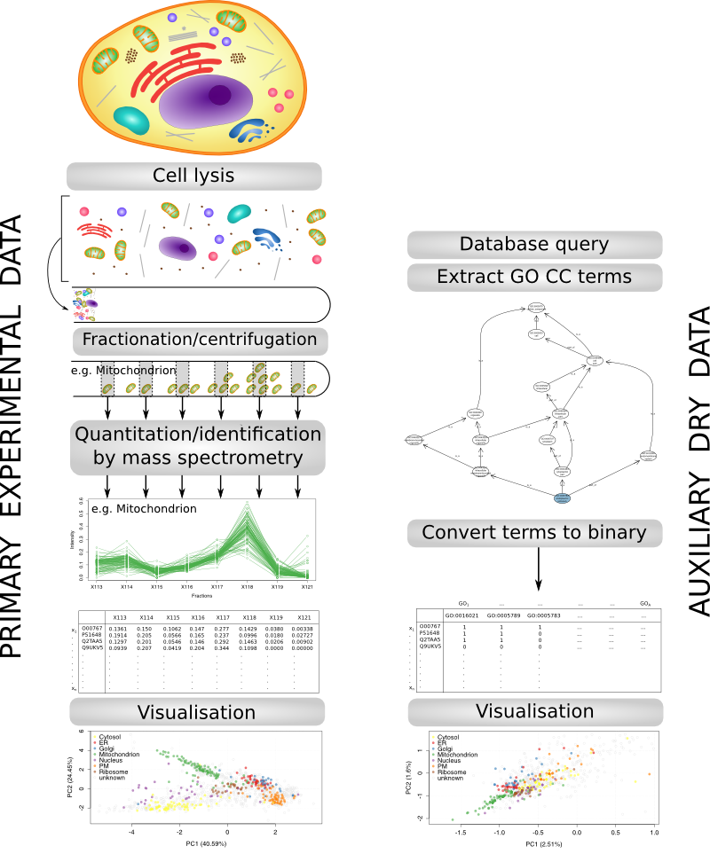

# A transfer learning algorithms for different data domains

Combining quantitative (spatial) proteomics and (binary) annotation
features.

### Standard spatial protoemics workflow


|     | F1   | F2   | ...  | Fm   |  markers   |
|----:|-----:|-----:|-----:|-----:|-----------:|
| p1  |q(1,1)|q(1,2)| ...  |q(1,m)| unknown    |
| p2  |q(2,1)|q(2,2)| ...  |q(2,m)| Mito       |
| p3  |q(3,1)|q(3,2)| ...  |q(3,m)| Golgi      |
| ... | ...  | ...  | ...  | ...  | ...        |
| pn  |q(n,1)|q(n,2)| ...  |q(n,m)| unknown    |


### Another data source

What about annotation data from repositories such as GO, sequence
features, signal peptide, transmembrane domains, images,
protein-protein interactions, ...

From a user perspective:

- free/cheap vs. expensive
- Abundant (all proteins, 100s of features) vs. (experimentally)
  limited/targeted (1000s of proteins, 6 - 20 of features)
- But, for localisation in system at hand: low vs. high quality
  (i.e. sub-cellular discriminative power and specificity)



### Data integration

We use a class-weighted kNN transfer learning algorithm to combine
primary and auxiliary data, based on
[Wu and Dietterich (2004)](http://citeseer.ist.psu.edu/viewdoc/summary?doi=10.1.1.94.594).

### [Method description](https://github.com/ComputationalProteomicsUnit/Intro-Integ-Omics-Prot/blob/master/thetatut.pdf?raw=true)

### Example code


```r
library("pRoloc")
library("pRolocdata")
data(andy2011)
ap <- setAnnotationParams(inputs =
                              c("Homo sapiens",
                                "UniProt/Swissprot ID"))

fData(andy2011)$UniProtKB.entry.name <- featureNames(andy2011)
featureNames(andy2011) <- fData(andy2011)$Accession.No.

andygoset <- makeGoSet(andy2011)

ttopt <- thetaOptimisation(andy2011, andygoset)
th <- getParams(opt)
thes <- thetaClassification(andy2011, andygoset, bestTheta = th)
```

### References

Gatto L, Breckels LM, Burger T, Nightingale DJ, Groen AJ, Campbell C,
Nikolovski N, Mulvey CM, Christoforou A, Ferro M, Lilley KS. A
foundation for reliable spatial proteomics data analysis. Mol Cell
Proteomics. 2014 Aug;13(8):1937-52. doi: 10.1074/mcp.M113.036350. Epub
2014 May 20. PubMed
PMID:[24846987](http://www.ncbi.nlm.nih.gov/pubmed/24846987); PubMed
Central PMCID:PMC4125728.


Gatto L, Breckels LM, Wieczorek S, Burger T, Lilley KS.
Mass-spectrometry-based spatial proteomics data analysis using pRoloc
and pRolocdata. Bioinformatics. 2014 May 1;30(9):1322-4. doi:
10.1093/bioinformatics/btu013. Epub 2014 Jan 11. PubMed
PMID:[24413670](http://www.ncbi.nlm.nih.gov/pubmed/24413670); PubMed
Central PMCID:PMC3998135.


Breckels LM, Holden S, Christoforou A, Lilley KS, Gatto L. A Transfer
Learning Framework for Spatial Proteomics Data. In prep.


| [Home](./README.md) | [Caveats](./Caveats.md) | [Mapping](./mapping.md) | [Transfer learning](./transfer-learning.md) |
